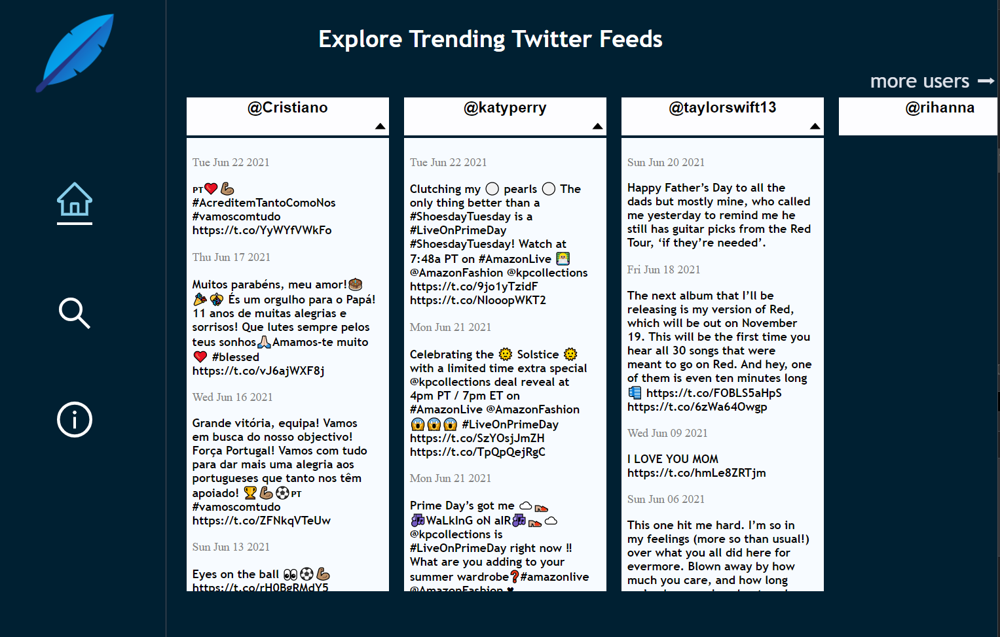

# Chirpr 
## Twitter API & Tweet Visualizations

This project is hosted on Heroku [View Chirpr Demo](https://chirpr-demo.herokuapp.com/).

## Summary

 Chirpr is a real-time social media parser built on React and Node.js. It pulls up-to-date tweets from twitter. The home page utilizes puppeteer.js to scrape the most followed twitter accounts wikipedia page to populate featured tweets. 
 
 I enjoyed recreating a social media type app. I learned how tweets, media etc. can become complex; including the basic interactions users expect to work. Secure user data, tooltips, comments and like counters to name a few. I also added puppeteer to help automate a trending accounts functionality. I felt that web scraping would build another real world solution into this project and help it stay timeless and relevant.

## Features

<ul>
  <li> Modern Splash/login
  <li> Scrapes wikipedia - 10 most followed Twitter accounts
  <li> Returns most followed streams
  <li> Search Twitter Streams
  <li> Responsive design with Ant design and custom components
</ul>

## Technologies

<ul>
  <li>Git</li>
  <li>Axios</li>
  <li>GitHub</li>
  <li>HTML 5</li>
  <li>React.js</li>
  <li>Express.js</li>
  <li>Puppeteer.js</li>
  <li>CSS Animation</li>
  <li>Heroku Hosting</li>
  <li>Twitter API 2.0</li>
</ul>

#### Wish List (next API version release)

<ul>
  <li> Tweet Media with tweets
  <li> Comment, like, share & retweet from Chirpr
  <li> Update favorites to localstorage
</ul>

### Helpful Resources

Heroku Node.js Basics [Heroku Dev Center | Deployment Resources](https://devcenter.heroku.com/articles/nodejs-support#node-js-runtimes)  
React/Node.js/Heroku -Deploy [Stackoverflow React/Heroku PostBuild Script](https://stackoverflow.com/questions/56485813/node-react-app-build-on-heroku-doesnt-end)

### Author

Duane McDonald | Software Developer  

<a href="https://www.linkedin.com/in/duane-mcd/">linkedIn</a>  
<a href="https://www.DuaneMcDonald.com">Personal Website</a>  
